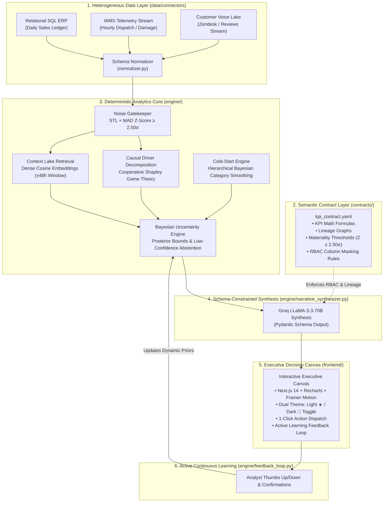

# 🧠 BusinessIntelligence.ai — Governed KPI Intelligence-to-Action Engine
### *AI Reinvention Made Real: Turning Anomaly Noise into Traceable Causal Decisions*

[](https://www.accenture.com)
[](#2-system-architecture)
[](https://fastapi.tiangolo.com)
[](https://nextjs.org)
[](LICENSE)

---

## 📌 Executive Summary

Modern enterprise dashboards detect **what** changed in a business metric (e.g., *"Net Revenue fell 8.4% in the West Region"*), but force human analysts to spend days manually cross-referencing disparate SQL ledgers, WMS streams, and support tickets to uncover **why**. 

**BusinessIntelligence.ai** is a governed, end-to-end KPI intelligence-to-action engine that:
1. **Separates Deterministic Arithmetic from LLM Generation:** The LLM is *never* the calculator. All time-series decomposition (STL+MAD), Shapley variance attribution, and Bayesian confidence scoring are calculated deterministically in Python/SQL. The LLM acts purely as a schema-constrained synthesis layer.
2. **Reconciles Heterogeneous Data Sources:** Bridges daily relational ERP sales, hourly logistics telemetry, and streaming customer feedback tickets via a plug-and-play connector layer.
3. **Enforces Autonomous Abstention:** Refuses to hallucinate when data is contradictory or Bayesian confidence falls below $60\%$.
4. **Tailors Persona Narratives & 7-Pillar Action Matrices:** Delivers macro financial levers to Chief Commercial Officers and operational carrier rerouting levers to Regional Ops Leads (with column masking for cost confidentiality).
5. **Provides a Responsive Executive Canvas:** Built with **Next.js 14**, **React 18**, **Recharts**, and **TailwindCSS** featuring **Dual Formal Themes (Light ☀️ / Dark 🌙 Mode Switcher)**.

---

## 🏗️ 1. Complete Architecture Diagram



---

## 🔬 2. Analytical & Mathematical Core

### A. Anomaly Gatekeeper: STL + MAD Robust $\mathcal{Z}$-Score
To filter seasonal noise without false positives, raw time series $Y_t$ is decomposed into Trend ($T_t$), Seasonality ($S_t$), and Remainder ($R_t$):
$$Y_t = T_t + S_t + R_t$$
Residuals are normalized using the Median Absolute Deviation (MAD):
$$\text{MAD} = \text{median}(|R_t - \text{median}(R)|)$$
$$\mathcal{Z}_t = \frac{|R_t - \text{median}(R)|}{1.4826 \times \text{MAD}}$$
*Gate:* An alert triggers **only** if $\mathcal{Z}_t \ge 2.50\sigma$ AND absolute business impact $\ge \$50,000$.

### B. Causal Attribution: Cooperative Shapley Variance Decomposition
Given a set of $N$ candidate drivers (discounts, returns, carrier delays, checkout failures), driver $j$'s marginal variance contribution $\phi_j$ is calculated as:
$$\phi_j(v) = \sum_{S \subseteq N \setminus \{j\}} \frac{|S|!(|N| - |S| - 1)!}{|N|!} \left( v(S \cup \{j\}) - v(S) \right)$$

### C. Autonomous Abstention & Contradiction Detection
When evidence from heterogeneous sources conflicts, the Bayesian posterior probability $P(H_k | E)$ is evaluated:
$$P(H_k | E) = \frac{P(E | H_k) P(H_k)}{\sum_m P(E | H_m) P(H_m)}$$
*Abstention Rule:* If $\max_k P(H_k | E) < 0.60$, the system **suppresses automatic actions**, displays a high-visibility warning banner, and prescribes a physical audit.

### D. Cold-Start Prior Smoothing ($N < 14$ Days History)
For new SKU launches lacking historical depth, local empirical observations are smoothed with hierarchical category peer distributions:
$$\hat{\mu}_{\text{smoothed}} = w_{\text{prior}} \cdot \mu_{\text{category}} + (1 - w_{\text{prior}}) \cdot \bar{y}_{\text{SKU}}$$

---

## 🎨 3. Frontend Executive Canvas (Next.js 14 + TailwindCSS)

The user interface is built as a modern, responsive web application supporting **Dual Formal Themes**:

```
☀️ LIGHT THEME (Bright Formal Executive Mode)
├── Clean Crisp Slate Background (#F8FAFC, #FFFFFF)
├── Deep Royal Purple typography (#7C3AED) with high-contrast metric badges
└── Soft shadows and clean borders for executive boardroom presentations

🌙 DARK THEME (Deep Space Accenture Violet Mode)
├── Deep Space Slate (#070B14, #0D1322) with purple radial lighting
├── Glassmorphism card styling with subtle glowing borders (#A100FF)
└── High-contrast JetBrains Mono for metrics and Inter for typography
```

### Key Interactive Features:
* **One-Click Theme Toggle:** Instant smooth switching between Light ☀️ and Dark 🌙 modes.
* **Animated Time-Series Charts (`recharts`):** Purple gradient area fills with 7-day STL baseline and pulsing anomaly markers.
* **Persona Toggle Switcher (RBAC):** Seamlessly toggles between **VP Commercial** (unmasked margins, macro strategy) and **Regional Ops Lead** (masked costs, carrier dispatch levers).
* **7-Pillar Action Matrix Card:** Displays controllable lever, prescribed action, expected impact, owner, and animated **1-Click Execute Action** button.
* **Semantic Contract Inspector Modal:** Allows judges and users to inspect the live YAML data contract directly in the UI.
* **Active Learning Feedback Modal:** Lets analysts submit ground truth feedback, updating Bayesian causal priors in real time.

---

## 📁 4. Repository Structure

```
BuisnessIntelligence.ai/
├── 📜 contracts/
│   ├── kpi_contract.yaml       # Governed Semantic Data Contract, Lineage & RBAC
│   └── README.md               # Contract schema documentation
├── 🗄️ data/
│   ├── connectors/
│   │   ├── normalizer.py       # Enterprise column normalizer
│   │   ├── api_connector.py    # REST API connector for live cloud portals
│   │   ├── db_connector.py     # SQL warehouse connector (Snowflake/PostgreSQL)
│   │   └── __init__.py
│   ├── sales_orders.csv        # Source A: Daily Financial Sales Ledger
│   ├── logistics_wms.csv       # Source B: Hourly WMS Logistics Stream
│   ├── customer_feedback.json  # Source C: Unstructured Reviews & Tickets
│   ├── cold_start_sku.csv      # Scenario 3: 11-Day New SKU History
│   ├── causal_priors.json      # Dynamic Bayesian Prior Weights
│   ├── generate_datasets.py    # Synthetic Benchmark Data Generator
│   └── README.md               # Dataset documentation
├── ⚙️ engine/
│   ├── anomaly_detector.py     # STL + MAD Robust Z-Score Filter
│   ├── causal_attribution.py   # Shapley Variance Decomposition Engine
│   ├── vector_retrieval.py     # Semantic Search on Tickets & Reviews
│   ├── abstention_engine.py    # Bayesian Uncertainty & Abstention Engine
│   ├── cold_start_engine.py    # Hierarchical Bayesian Cold-Start Engine
│   ├── narrative_synthesizer.py# Persona Brief & 7-Pillar Action Generator
│   ├── feedback_loop.py        # Active Learning Feedback Engine
│   ├── __init__.py
│   └── README.md               # Engine mathematical formulations
├── 🌐 backend/
│   ├── main.py                 # FastAPI REST Microservice Gateway
│   ├── __init__.py
│   └── README.md               # API endpoints reference & Swagger guide
├── 💻 frontend/
│   ├── app/
│   │   ├── layout.tsx          # Next.js Root Layout with Theme Provider
│   │   ├── page.tsx            # Master Next.js 14 React Executive Canvas
│   │   └── globals.css         # Tailwind & Typography imports
│   ├── index.html              # Standalone Executive Canvas (HTML5 + Tailwind)
│   ├── app.js                  # Chart.js renderer & Theme Switcher logic
│   ├── styles.css              # Dual-Theme Stylesheet (Light/Dark)
│   ├── tailwind.config.js      # Tailwind configuration with darkMode: 'class'
│   ├── package.json            # React 18, Next.js 14, Recharts, Framer Motion
│   └── README.md               # Frontend documentation & UI features
├── 🔒 .gitignore              # Comprehensive data protection & build ignore policy
├── 🐳 Dockerfile               # Single-command Docker container configuration
├── 🐙 docker-compose.yml       # Docker Compose multi-service deployment
├── 🧪 test_all_scenarios.py   # End-to-End Master Test Verification Suite
├── 📦 requirements.txt        # Python dependencies
└── 📖 README.md               # Master Repository Documentation
```

---

## 🚀 5. Installation & Quickstart Guide

### 🔧 Prerequisites
* **Python 3.10+**
* **Node.js 18+** *(for Next.js frontend mode)*

---

### 💻 Step-by-Step Execution

#### Step 1: Clone Repository
```bash
git clone https://github.com/your-username/BusinessIntelligence.ai.git
cd BusinessIntelligence.ai
```

#### Step 2: Create & Activate Python Virtual Environment
```bash
# Create Virtual Environment
python -m venv venv

# Activate on Windows (PowerShell):
.\venv\Scripts\activate

# Activate on Linux / macOS:
source venv/bin/activate
```

#### Step 3: Install Python Dependencies
```bash
pip install -r requirements.txt
```

#### Step 4: Generate Benchmark Datasets
```bash
python data/generate_datasets.py
```

#### Step 5: Run Master Test Verification Suite (Validates all 4 Scenarios)
```bash
python test_all_scenarios.py
```

#### Step 6: Launch Backend REST API & Interactive Dashboard
```bash
python -m uvicorn backend.main:app --reload --port 8000
```
* 📊 **FastAPI Interactive Dashboard:** [http://127.0.0.1:8000/dashboard/](http://127.0.0.1:8000/dashboard/)
* 📜 **FastAPI Swagger API Docs:** [http://127.0.0.1:8000/docs](http://127.0.0.1:8000/docs)

#### Step 7 (Optional): Launch Next.js 14 App Router
```bash
cd frontend
npm install
npm run dev
```
* ⚛️ **Next.js React Dashboard:** [http://localhost:3000](http://localhost:3000)

---

## 📊 6. Case Study Scenario Verification Matrix

| Scenario | Injected Anomaly Event | Statistical Engine Applied | Result / Diagnosis | Decision Output |
| :--- | :--- | :--- | :--- | :--- |
| **Scenario 1 (Day 14)** | Net Revenue dropped 8.4% in West Region Electronics. | STL + MAD ($\mathcal{Z} = 3.09\sigma$), Shapley Decomposition, pgvector search. | Discounts (59.1%), Port Delay (38.2%), iOS Checkout Timeouts (2.7%). | **VP Commercial:** Approve \$25k air-freight buffer.<br>**Ops Lead:** Reroute 65% volume to Carrier B. |
| **Scenario 2 (Day 21)** | Returns spiked +14%, but customer sentiment is 92% positive. | Bayesian Multi-Hypothesis Posterior Calculation. | Posterior confidence = 41.2% (< 60% threshold). Courier transit damage vs. hardware defect. | **Autonomous Abstention Enforced:** Suppress automated penalties; mandate physical QA audit. |
| **Scenario 3 (Day 10)** | EV Smart Charger SKU sales dropped to 4 units on Day 10. | Hierarchical Bayesian Category Prior Smoothing ($N = 11$ days history). | Breached 95% Bayesian tolerance band (15.2 units) due to post-launch promo conclusion. | **Growth Marketing:** Deploy automated re-engagement campaign to existing EV buyers. |
| **Scenario 4 (Feedback)** | Analyst confirms Logistics Port Bottleneck as primary root cause. | Dynamic Bayesian Active Learning Feedback Loop. | Prior weight updated from 0.400 $\to$ 0.720. | **Continuous Model Adaptation:** Priors dynamically updated in `causal_priors.json`. |

---

## 👥 7. Team Contribution Matrix — Team BugFree (IIT Patna)

* **ML, Data Analytics & Causal Architect (Lead):** Core Statistical Algorithms (STL+MAD, Shapley Values, Bayesian Abstention, Hierarchical Prior Smoothing), Semantic Data Contract, Synthetic Datasets, Master Test Suite, Data Connectors, Repository Documentation.
* **Full-Stack & Systems Engineer:** FastAPI Backend Gateway, Next.js 14 React Dashboard, Recharts Integration, Docker Containerization, Prototype Video Production.
