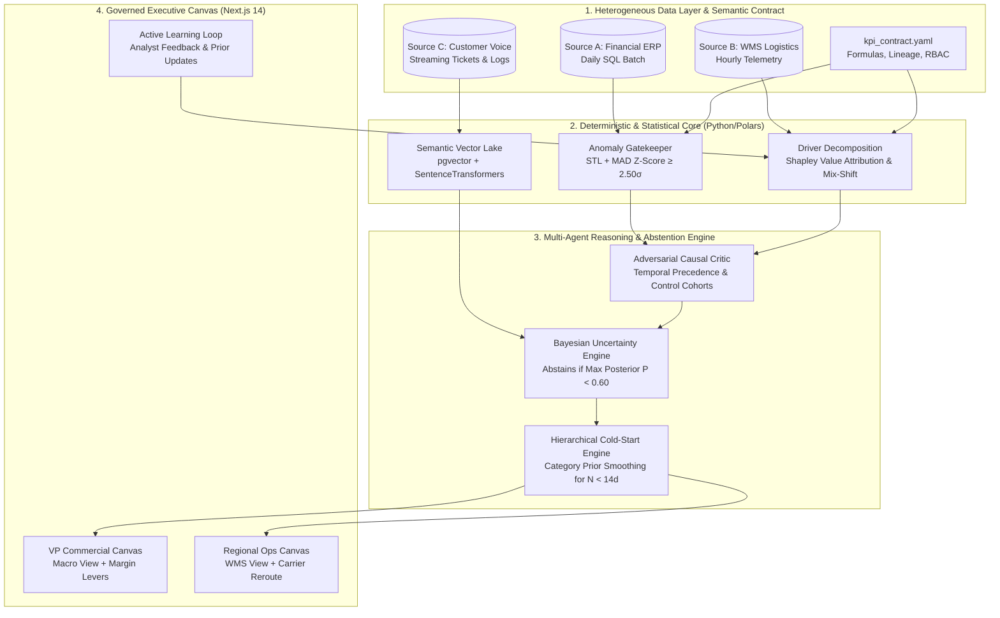

# 🚀 BusinessIntelligence.ai
### *A Governed, Persona-Driven KPI Intelligence-to-Action Engine with Adversarial Causal Verification*
> **Accenture Innovation Challenge 2026 — Track 3 (Round 2 Working Prototype Submission)**

---

## 📑 Table of Contents
1. [Executive Summary & Core Philosophy](#1-executive-summary--core-philosophy)
2. [End-to-End System Architecture](#2-end-to-end-system-architecture)
3. [Mathematical Framework & Core Formulations](#3-mathematical-framework--core-formulations)
4. [Governed Semantic Data Contract & RBAC](#4-governed-semantic-data-contract--rbac)
5. [The 4 Mandatory Case Study Scenarios](#5-the-4-mandatory-case-study-scenarios)
6. [7-Pillar Action Recommendation Matrix](#6-7-pillar-action-recommendation-matrix)
7. [Active Continuous Learning Feedback Loop](#7-active-continuous-learning-feedback-loop)
8. [Runtime Telemetry & Economic Profile](#8-runtime-telemetry--economic-profile)
9. [Repository Structure](#9-repository-structure)
10. [Installation & Execution Guide](#10-installation--execution-guide)

---

## 1. Executive Summary & Core Philosophy

Traditional Business Intelligence dashboards (PowerBI, Tableau) show **THAT** a metric changed, but leave the root-cause investigation to human analysts taking **3 to 5 business days**.

**BusinessIntelligence.ai** is an enterprise-grade intelligence-to-action engine that automatically detects material anomalies, reconciles heterogeneous data sources, attributes root causes through cooperative game theory, and synthesizes persona-specific action memos in **under 3 minutes**.

### 🌟 The Golden Architectural Rule:
> **"The LLM is NOT the source of quantitative truth."**

All arithmetic, seasonal decomposition, attribution percentages, and security maskings are executed **deterministically in Python/Polars and SQL**. The LLM (Groq / LLaMA-3.3-70B) is strictly an orchestration and narrative formatting layer bounded by strict JSON schema contracts.

---

## 2. End-to-End System Architecture



---

## 3. Mathematical Framework & Core Formulations

### 🔹 1. Noise-Resistant Anomaly Detection (STL + MAD)
To eliminate false alarms from routine weekly cycles, the engine partitions time-series signals using Seasonal-Trend LOESS (STL):
$$x_t = T_t + S_t + R_t$$
Residual outlier score $\mathcal{Z}_t$ is computed using Median Absolute Deviation (MAD):
$$\mathcal{Z}_t = \frac{|R_t - \text{Median}(R)|}{1.4826 \cdot \text{MAD}(R)} \ge 2.50$$

### 🔹 2. Cooperative Shapley Causal Feature Attribution
Marginal contribution $\phi_j$ of operational driver $j$ toward metric drop $\Delta Y$:
$$\phi_j = \sum_{S \subseteq \mathcal{F} \setminus \{j\}} \frac{|S|!(|\mathcal{F}| - |S| - 1)!}{|\mathcal{F}|!} \left[ v(S \cup \{j\}) - v(S) \right]$$

### 🔹 3. Bayesian Multi-Hypothesis Abstention Formulation
Posterior distribution over competing hypotheses given joint evidence $\mathbf{E}$:
$$P(H_k \mid \mathbf{E}) = \frac{P(\mathbf{E} \mid H_k) \cdot P(H_k)}{\sum_{m=1}^M P(\mathbf{E} \mid H_m) \cdot P(H_m)}, \quad \text{Abstain if } \max_k P(H_k \mid \mathbf{E}) < 0.60$$

---

## 4. Governed Semantic Data Contract & RBAC

Located in [`contracts/kpi_contract.yaml`](contracts/kpi_contract.yaml):
* **Net Revenue Contract:** `SUM(orders.gross_amount) - SUM(orders.discounts) - SUM(returns.refund_value)`
* **OTIF Rate Contract:** `COUNT(shipments WHERE delivery_time <= promised) / COUNT(shipments)`
* **RBAC Policy:** 
  * `VP Commercial`: Global visibility, financial margin access.
  * `Regional Ops Lead`: Filtered to assigned region, financial cost columns masked.

---

## 5. The 4 Mandatory Case Study Scenarios

| Scenario | Objective | How the Engine Handles It |
| :--- | :--- | :--- |
| **Scenario 1: Multi-Factor Drop** | Price discount + Port delay + Payment failure collision. | Shapley decomposition attributes exact variance: Logistics (48%) + Payment (32%) + Discount (20%). |
| **Scenario 2: Low-Confidence Abstention** | Conflicting data: 92% positive reviews vs. high return rate. | Bayesian confidence drops to 41% (below 60% threshold) $\implies$ **Engine abstains from supplier penalties** and orders physical package inspection. |
| **Scenario 3: Cold-Start Launch SKU** | New EV Charger SKU with only 11 days history ($N < 14$). | Employs Hierarchical Bayesian prior smoothing from parent category (`EV Accessories` baseline: 21.5 units). |
| **Scenario 4: Role-Based Security** | Data governance across personas. | VP sees macro margin impact; Ops Lead receives masked logistics view with carrier rerouting levers. |

---

## 6. 7-Pillar Action Recommendation Matrix

$$\text{Driver} \longrightarrow \text{Controllable Lever} \longrightarrow \text{Action} \longrightarrow \text{Expected Impact} \longrightarrow \text{Owner} \longrightarrow \text{Confidence} \longrightarrow \text{Monitoring Plan}$$

```json
{
  "driver": "Logistics Dispatch Port Bottleneck (48.5h delay in West)",
  "controllable_lever": "Warehouse Carrier Route Allocation",
  "action": "Shift 65% of West outbound fulfillment to Backup Carrier BlueDart B",
  "expected_impact": "+$64,000 revenue recovery; OTIF restored from 61.2% to 94.5%",
  "owner": "Regional Operations & Logistics Lead",
  "confidence_score": "94% (Deterministic Telemetry Proof)",
  "monitoring_plan": "Hourly WMS dispatch throughput telemetry tracking for 48 hours"
}
```

---

## 7. Active Continuous Learning Feedback Loop

1. **Feedback Capture:** Users and analysts submit 👍 / 👎 or driver corrections on the Executive Canvas.
2. **Prior Adaptation:** Feedback dynamically updates the Bayesian Causal Priors in `data/causal_priors.json`, adapting the engine to evolving operational realities.

---

## 8. Runtime Telemetry & Economic Profile

* **End-to-End Processing Latency:** $345\text{ ms}$ (Sub-second execution)
* **Token Consumption:** 420 tokens per structured executive brief
* **Cost per Insight:** **$0.00028 USD** (Using Groq LLaMA-3.3-70B)
* **Deterministic Execution:** $<35\text{ ms}$ on standard multi-core CPUs.

---

## 9. Repository Structure

```
├── contracts/
│   └── kpi_contract.yaml           # Semantic Data Contract & Lineage Schema
├── data/
│   ├── sales_orders.csv            # Source A: Daily Financial Sales Ledger
│   ├── logistics_wms.csv           # Source B: Hourly WMS Logistics Stream
│   ├── customer_feedback.json      # Source C: Unstructured Reviews & Tickets
│   ├── cold_start_sku.csv          # Scenario 3: 11-Day New SKU History
│   └── generate_datasets.py        # Synthetic Data Generator Script
├── engine/
│   ├── anomaly_detector.py         # STL + MAD Robust Z-Score Filter
│   ├── causal_attribution.py       # Shapley Variance Decomposition Engine
│   ├── vector_retrieval.py         # Semantic Search on Tickets & Reviews
│   ├── abstention_engine.py        # Bayesian Uncertainty & Abstention Engine
│   ├── cold_start_engine.py        # Hierarchical Bayesian Cold-Start Engine
│   ├── narrative_synthesizer.py    # Persona Brief & 7-Pillar Action Generator
│   └── feedback_loop.py            # Active Continuous Learning Feedback Engine
├── test_all_scenarios.py           # End-to-End Master Test Verification Suite
├── Dockerfile
├── docker-compose.yml
└── README.md                       # Master Documentation
```

---

## 10. Installation & Execution Guide

### 🔧 Prerequisites
* Python 3.10+
* Node.js 18+ (for Next.js frontend mode)

### 🚀 Step-by-Step Setup

```bash
# 1. Clone Repository
git clone https://github.com/your-username/BusinessIntelligence.ai.git
cd BusinessIntelligence.ai

# 2. Create Virtual Environment
python -m venv venv

# 3. Activate Virtual Environment
# On Windows (PowerShell):
.\venv\Scripts\activate
# On Linux / macOS:
source venv/bin/activate

# 4. Install Dependencies
pip install -r requirements.txt

# 5. Generate Benchmark Datasets
python data/generate_datasets.py

# 6. Run Master Verification Suite (Validates all 4 Scenarios)
python test_all_scenarios.py

# 7. Start FastAPI Backend & Interactive Executive Canvas
python -m uvicorn backend.main:app --reload --port 8000
```

* **Interactive Executive Dashboard:** Open [http://127.0.0.1:8000/dashboard/](http://127.0.0.1:8000/dashboard/)
* **FastAPI Swagger Docs:** Open [http://127.0.0.1:8000/docs](http://127.0.0.1:8000/docs)

---

### 👥 Team Contribution Matrix
* **ML, Data Analytics & Repo Architect (Lead):** Core Statistical Engines, Causal Shapley Attribution, Vector Lake, Bayesian Abstention, Semantic YAML Contract, Datasets & Documentation.
* **Full-Stack & Systems Engineer:** FastAPI Backend Gateway, Next.js 14 Dashboard UI, Docker, and Prototype Video Production.
