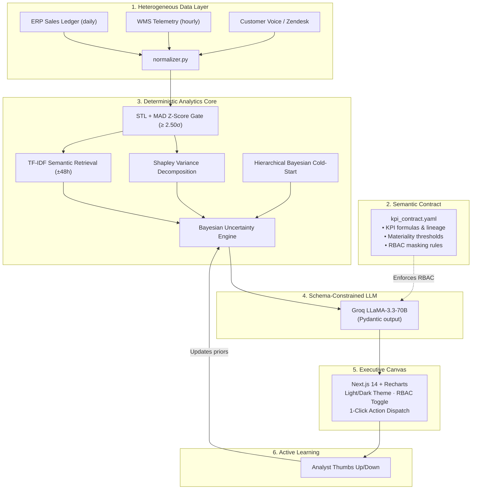

# BusinessIntelligence.ai — KPI Intelligence-to-Action Engine

> **Accenture Innovation Challenge 2026**  
> Team BugFree · IIT Patna

A governed, end-to-end analytics engine that detects **what** changed in a business KPI and explains **why** — deterministically — before prescribing a persona-tailored action.

---

## What it does

Enterprise dashboards tell you a metric dropped. This system tells you which driver caused it, how confident it is, and what to do next — without hallucinating.

**Core design principles:**
- The **LLM never does math.** All anomaly detection, Shapley attribution, and Bayesian scoring run in pure Python/SQL. The LLM only writes the final narrative against a Pydantic schema.
- **Autonomous Abstention:** If Bayesian posterior confidence falls below 60%, the system withholds automated actions and flags a physical audit.
- **RBAC Persona Masking:** VP Commercial sees full margin data. Regional Ops Lead sees operational levers only — cost columns masked by the semantic contract.

---

## Architecture



---

## Analytical Core

### A. Anomaly Detection — STL + MAD Z-Score

$$Y_t = T_t + S_t + R_t \qquad \mathcal{Z}_t = \frac{|R_t - \text{median}(R)|}{1.4826 \times \text{MAD}}$$

Alert fires only when $\mathcal{Z}_t \ge 2.50\sigma$.

### B. Causal Attribution — Cooperative Shapley Values

$$\phi_j = \sum_{S \subseteq N \setminus \{j\}} \frac{|S|!(|N|-|S|-1)!}{|N|!}\bigl(v(S \cup \{j\}) - v(S)\bigr)$$

### C. Autonomous Abstention — Bayesian Posterior

$$P(H_k | E) = \frac{P(E|H_k)\,P(H_k)}{\sum_m P(E|H_m)\,P(H_m)}$$

If $\max_k P(H_k|E) < 0.60$ → system abstains, suppresses automated actions.

### D. Cold-Start Prior Smoothing ($N < 14$ days)

$$\hat{\mu}_{\text{smoothed}} = 0.65\cdot\mu_{\text{category}} + 0.35\cdot\bar{y}_{\text{SKU}}$$

---

## Repository Structure

```
BuisnessIntelligence.ai/
├── contracts/
│   └── kpi_contract.yaml        # Semantic contract, lineage, RBAC
├── data/
│   ├── connectors/
│   │   ├── api_connector.py     # REST API ingest
│   │   ├── db_connector.py      # SQL warehouse ingest
│   │   └── normalizer.py        # Schema normalizer
│   ├── sales_orders.csv
│   ├── logistics_wms.csv
│   ├── customer_feedback.json
│   └── cold_start_sku.csv
├── engine/
│   ├── anomaly_detector.py
│   ├── causal_attribution.py
│   ├── vector_retrieval.py
│   ├── abstention_engine.py
│   ├── cold_start_engine.py
│   ├── narrative_synthesizer.py
│   └── feedback_loop.py
├── backend/
│   └── main.py                  # FastAPI gateway
├── frontend/
│   ├── app/page.tsx             # Next.js 14 executive canvas
│   └── index.html               # Standalone HTML fallback
├── test_all_scenarios.py
├── requirements.txt
└── Dockerfile
```

---

## Quickstart

**Everything runs with a single Python command.** The dashboard is served directly by FastAPI — no Node.js required.

```bash
# 1. Clone and set up environment

git clone https://github.com/BugFreeIITP/BusinessIntelligence-ai.git
python -m venv venv && .\venv\Scripts\activate   # Windows
pip install -r requirements.txt

# 2. Generate benchmark datasets
python data/generate_datasets.py

# 3. Run the full verification suite (validates all 4 scenarios)
python test_all_scenarios.py

# 4. Start — that's it
python -m uvicorn backend.main:app --reload --port 8000
```

| URL | What |
|-----|------|
| `http://127.0.0.1:8000/dashboard/` | 🖥️ Executive Dashboard (HTML + Chart.js) |
| `http://127.0.0.1:8000/docs` | 📄 Interactive Swagger API docs |
| `http://127.0.0.1:8000/api/scenarios/run` | ⚙️ Scenario engine endpoint |

---

## Case Study Scenarios

| # | Event | Engine | Decision |
|---|-------|--------|----------|
| **1** | Net Revenue −8.4%, West Region (Day 14) | STL+MAD (Z=3.09), Shapley, pgvector | Discounts 59%, Port Delay 38%, iOS Checkout 2.7% · **VP: approve $25k air-freight** |
| **2** | Returns +14% but sentiment 92% positive (Day 21) | Bayesian posterior = 41% | **Abstention enforced** · mandate physical QA audit |
| **3** | EV Charger SKU drops to 4 units (Day 10, 11-day history) | Hierarchical Bayesian smoothing | Breached 95% band · **deploy re-engagement campaign** |
| **4** | Analyst confirms logistics bottleneck root cause | Active learning feedback | Prior 0.400 → 0.720 · **dynamic prior update** |

---

## Team — BugFree (IIT Patna)

- **ML & Causal Architect:** STL+MAD, Shapley, Bayesian abstention, cold-start smoothing, semantic contract, datasets, tests
- **Full-Stack & Systems:** FastAPI backend, Next.js 14 dashboard, Recharts, Docker
