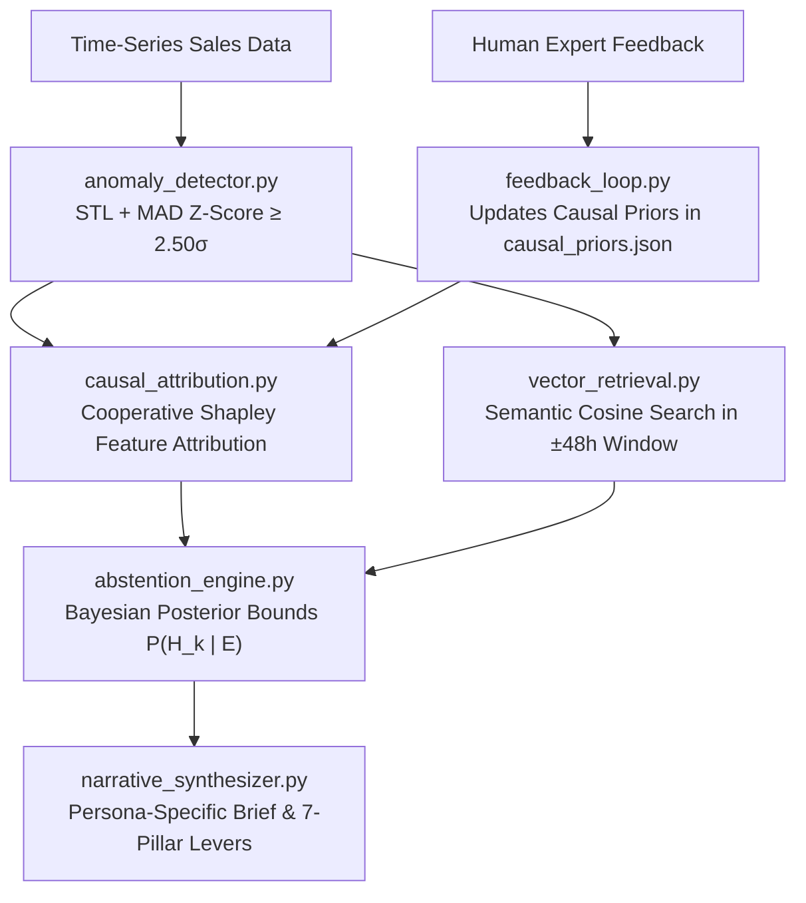

# ⚙️ Deterministic & Causal Analytics Core (`/engine`)

This directory houses the deterministic mathematical algorithms, causal attribution models, vector retrieval modules, and Bayesian reasoning engines that power **BusinessIntelligence.ai**.

---

## 📁 Directory Structure
```
engine/
├── anomaly_detector.py        # STL + MAD Robust Z-Score Noise Filter (Z ≥ 2.50σ)
├── causal_attribution.py      # Cooperative Shapley Driver Decomposition & Simpson's Check
├── vector_retrieval.py        # TF-IDF Cosine Semantic Search across Customer Voice Lake (±48h window)
├── abstention_engine.py       # Bayesian Contradiction & Low-Confidence Abstention (<60%)
├── cold_start_engine.py       # Hierarchical Bayesian Prior Smoothing for Sparse SKUs (<14d)
├── narrative_synthesizer.py   # Grounded Persona Narrative & 7-Pillar Action Matrix
├── feedback_loop.py           # Active Continuous Learning & Prior Updating Engine
├── __init__.py                # Engine package initializer
└── README.md                  # Directory documentation
```

---

## 🔬 Mathematical Formulations & Execution Flow



### Module Summary:
1. **`anomaly_detector.py`**: Decomposes series into Trend + Seasonality + Residuals using LOESS. Computes robust $\mathcal{Z}$-scores via Median Absolute Deviation.
2. **`causal_attribution.py`**: Computes exact marginal driver contributions using cooperative game theory ($\phi_j$) and checks for Simpson's Paradox.
3. **`vector_retrieval.py`**: Embeds text using TF-IDF (bigram, sklearn) and retrieves top matching ticket excerpts within the temporal anomaly interval via cosine similarity.
4. **`abstention_engine.py`**: Evaluates posterior probabilities over competing hypotheses. Enforces autonomous abstention when $\max P < 0.60$.
5. **`cold_start_engine.py`**: Blends local empirical observations with category peer prior distributions for newly launched SKUs.
6. **`narrative_synthesizer.py`**: Constructs structured executive narratives and 7-pillar action plans tailored to user personas.
7. **`feedback_loop.py`**: Adapts Bayesian prior distributions based on analyst validations.
